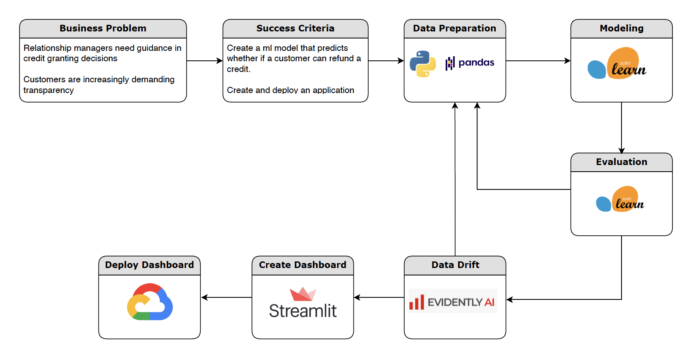
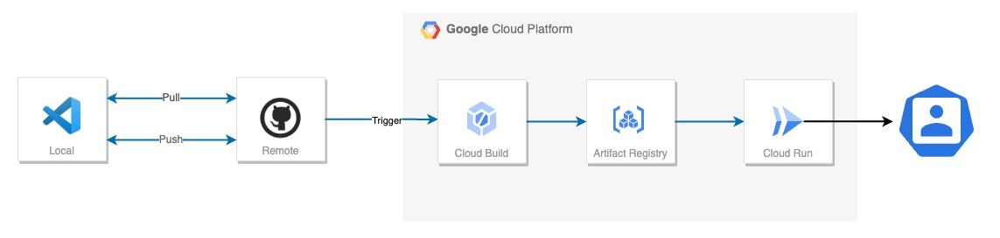

## Description
**Home Credit** is a financial company that offers consumer credit.
**Credit Score Project** is a tool that aims to give a **guidance in credit granting decision** for Home Credit Relationship Managers.

 

## Project Road Map 

This project has 2 main parts such as : **Analysis & Modeling** and **Dashboard dev & deployment**£.

## Analysis & Modeling
Here, we will work mostly on **jupyter notebook environment**. We will have 3 subparts such as : 
- **Data Preparation** : cleaning, exploring, feature engineering, resampling
- **Modeling** : modeling, tuning, tracking mlflow
- **Monitoring** : data drift report with evidently and cinnamon

## Dashboard dev & deployment
Here we used VScode and bash to code and deploy the web application.
- Dashboard : structuring and coding the web application with streamlit. 
- Industrilization : compiling, testing and deploying the applicaiotn.

## Continious deployment

## Web Application Acces 
To acces the web app : [Click here ](https://loan-scoring-3hnypmlvvq-ew.a.run.app/)