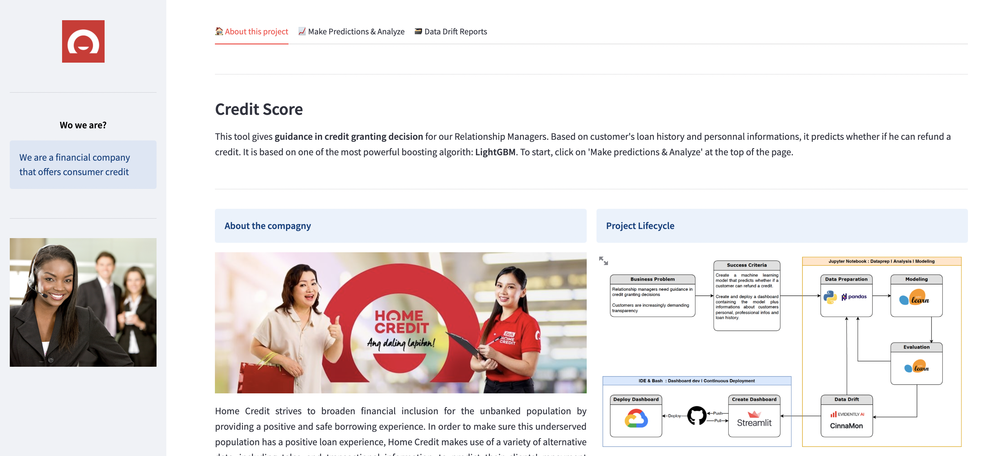

## Overview


This section is about the web application. It is a dashboard coded with streamlit.

## Structure
```bash
.
├── Dockerfile
├── README.md
├── __pycache__
│   ├── app.cpython-310.pyc
│   ├── app.cpython-39.pyc
│   └── test.cpython-39.pyc
├── app.py
├── data
│   ├── cover.jpg
│   ├── data_drift_report.html
│   ├── data_stability_report.html
│   ├── explainability.png
│   ├── full_data.pkl
│   ├── home_credit.jpeg
│   ├── lifecycle.png
│   ├── logo.png
│   ├── reminders.png
│   └── training_features.pkl
├── models
│   ├── best_lightGBM_model.pkl
│   ├── best_model.pkl
│   ├── lgbm_balanced.pkl
│   ├── model
│   └── model_opti.pkl
├── poetry.lock
├── pyproject.toml
└── tests
    ├── __init__.py
    └── test_unit.py
```
